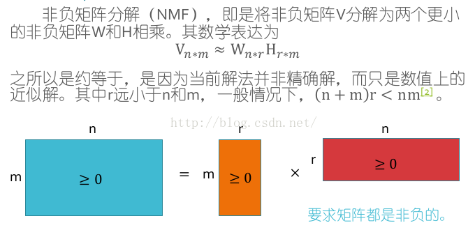
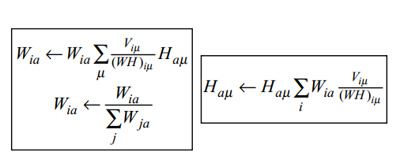

# 矩阵分解
介绍几个常见的矩阵分解,以及用于做简单的推荐系统

## Cholesky分解
如果矩阵X是对称正定的，则Cholesky分解将矩阵X分解成一个下三角矩阵和上三角矩阵的乘积。设上三角矩阵为R,则下三角矩阵为其转置，即X=R'R。

#### 正定矩阵
设M是n阶方阵，如果对任何非零向量z，都有zTMz> 0，其中zT表示z的转置，就称M正定矩阵。

##### 正定矩阵判定定理

判定定理1：对称阵A为正定的充分必要条件是：A的特征值全为正。

判定定理2：对称阵A为正定的充分必要条件是：A的各阶顺序主子式都为正。

判定定理3：任意阵A为正定的充分必要条件是：A合同于单位阵。

##### 正定矩阵性质

1.正定矩阵的任一主子矩阵也是正定矩阵。

2.若A为n阶对称正定矩阵，则存在唯一的主对角线元素都是正数的下三角阵L，使得A=L*L′，此分解式称为 正定矩阵的楚列斯基（Cholesky）分解。
      
3.若A为n阶正定矩阵，则A为n阶可逆矩阵。

## LU分解（三角分解）
可以将一个矩阵分解为一个单位下三角矩阵和一个上三角矩阵的乘积（有时是它们和一个置换矩阵的乘积）。当A的所有顺序主子式都不为0时，矩阵A可以分解为A=LU（所有顺序主子式不为0，矩阵不一定不可以进行LU分解）。其中L是下三角矩阵，U是上三角矩阵。

算法思想：从下至上地对矩阵A做初等行变换，将对角线左下方的元素变成0，这些行变换的效果等同于左乘一系列单位下三角矩阵，这个单位下三角矩阵就是L，而变换最后得到的上三角矩阵就是U。

分解算法如下：（其中alpha代表L矩阵的元素，beta代表U矩阵的元素）

## QR分解（正交变换）
QR分解将矩阵分解成一个正规正交矩阵和一个三角矩阵。原始矩阵不必一定是方阵。如果矩阵A是m×n阶的，则矩阵q是m×m阶的，矩阵r是m×n阶的。

## 奇异值分解（SVD）
如存在两个矢量u,v及一常数c,使得矩阵A满足：Av=cu,  A’u=cv。称c为奇异值，称u,v为奇异矢量。

将奇异值写成对角方阵∑，而相对应的奇异矢量作为列矢量则可写成两个正交矩阵U，V， 使得： AV=U∑， A‘U=V∑  因为U，V正交，所以可得奇异值表达式：A=U∑V’。
一个m行n列的矩阵A经奇异值分解，可求得m行m列的U, m行n列的矩阵∑和n行n列的矩阵V。

## 非负矩阵分解（NMF）
对于任意给定的一个非负矩阵A，NMF算法能够寻找到一个非负矩阵U和一个非负矩阵V，从而将一个非负的矩阵分解为左右两个非负矩阵的乘积。

NMF算法：

分解前后可理解为：原始矩阵V的列向量是对左矩阵W中所有列向量的加权和，而权重系数就是右矩阵H对应列向量的元素，故称为W基矩阵，H为系数矩阵。一般情况下r的选择要比n小，即满足(m+n)*r < mn。

这时用系数矩阵代替原始矩阵，就可以实现对原始矩阵进行降维，得到数据特征的降维矩阵，从而减少存储空间，减少计算机资源。
